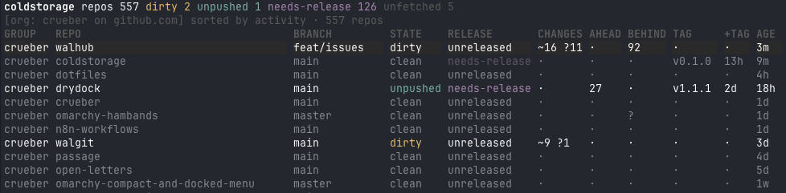

# coldstorage

A terminal dashboard for a fleet of git repositories — what's dirty, what's
unpushed, and what's worth releasing, across every checkout you own, live.



**coldstorage is the Go reimplementation of
[drydock](https://github.com/yetidevworks/drydock)**, Andy Miller's Rust
dashboard for a fleet of git repos. drydock's ideas — the dashboard grammar,
the git semantics, the honest reporting — are the foundation this project is
built on; `GO-PORT-SPEC.md` is drydock's behavioral specification, adapted
for the port, and this repository follows it feature for feature. If you use
coldstorage and like it, go star
[drydock](https://github.com/yetidevworks/drydock) — it is the original.
Why a rewrite exists, and why Go, is its own story:
[REWRITE-FROM-DRYDOCK.md](REWRITE-FROM-DRYDOCK.md).

---

## Install

**Homebrew** (macOS and Linux):

```sh
brew install crueber/tap/coldstorage
```

**Linux / anywhere with a shell** — installs to `~/.local/bin`:

```sh
curl -fsSL https://raw.githubusercontent.com/crueber/coldstorage/main/install.sh | sh
```

Set `COLDSTORAGE_INSTALL_DIR` to install somewhere else. Every release also
ships a tarball per platform (zip on Windows) with the binary, the docs, and
a `checksums.txt` on the
[releases page](https://github.com/crueber/coldstorage/releases).

Or let Go build it:

```sh
go install github.com/crueber/coldstorage/cmd/coldstorage@latest
```

Or from a clone:

```sh
git clone git@github.com:crueber/coldstorage.git
cd coldstorage && go install ./cmd/coldstorage
```

Run `coldstorage` — there are no subcommands. First launch scans
`~/Projects` (the default root), and the config below is created at
`~/.config/coldstorage/config.toml` on Linux,
`~/Library/Application Support/coldstorage/config.toml` on macOS.

## Configuration

A minimal config is two lines:

```toml
roots = ["~/Projects", "~/dev/github.com"]
```

A full reference (every key, every default) lives in `GO-PORT-SPEC.md` §4.
The shape:

```toml
roots = ["~/Projects", "~/dev/github.com"]
max_depth = 4                        # how deep discovery descends
exclude = ["**/archived/**"]         # doublestar globs; `x/**` excludes x
prune = ["node_modules", "vendor"]   # directory names never descended

[refresh]
interval = "5m"                      # background resweep cadence
debounce = "1s"                      # watcher quiet window
watch = true                         # filesystem watching (per-repo, selective)

[remote]
fetch = true                         # fetch before computing ahead/behind
concurrency = 4
timeout = "20s"

[release]
tag_pattern = "*[0-9]*"              # which tags count as releases
max_subjects = 30

[ui]
default_filters = []                 # e.g. ["dirty", "unpushed"]
default_sort = "activity"
theme = "auto"                       # auto | dark | light — see Theming
git_client_command = []              # t — empty = auto-detect (lazygit, gitui, tig)
file_manager_command = []            # o — empty = auto-detect (spf, yazi, ranger, nnn)
terminal_command = []                # T — empty = $SHELL; {path} is the repo root

[ui.group_colors]
decisiv = "#1f2d3d"                  # any group name; hex or ANSI names (red, blue, bright-cyan, …)
crueber = "blue"

[[orgs]]
provider = "github"                  # github | gitlab | gitea
host = "github.com"
owner = "acme"
path = "~/dev/github.com/acme"       # where checkouts live; created on first sync
# login = "work"                     # gitea/tea only: which login to use
# protocol = "https"                 # ssh (default) | https
# enabled = true                      # false = registered but never synced
# include_forks = false
# include_archived = false
# include_subgroups = false           # gitlab only
# exclude = ["archived-*"]
```

Durations are suffix-rich (`500ms`, `30s`, `5m`, `2h`, `7d`, `2w`, `3mo`,
`1y`; bare numbers are seconds).

## The dashboard

Columns, left to right: **GROUP · REPO · BRANCH · STATE · RELEASE · CHANGES
· AHEAD · BEHIND · TAG · +TAG · AGE**, with VISIBILITY, STASHES, and FETCHED
toggleable. The table always spans the full terminal width — REPO and BRANCH
are flexible and absorb the space — and column widths never reflow while you
scroll or move the cursor.

**Keys** (table): `j/k` move · `ctrl-d/ctrl-u` half page · `pgup/pgdn` ·
`home/end` · `⏎` detail · `d u r N b c i x e n` filters (dirty, unpushed,
released, needs-release, bare, conflicts, needs-attention, excluded,
errors, never-fetched) · `&` any/all · `a` clear all · `[` `]` cycle group ·
`O` cycle org filter · `0-4` age presets · `s` cycle sort · `S` reverse ·
`/` fuzzy search · `p` sync repo · `P` sync all · `C` column picker ·
`A` org manager · `G` group colors · `R` rescan · `?` help · `q` quit.

**The chrome**: line one is the fleet — total repos, dirty, unpushed,
needs-release, and never-fetched counts — with the operation widget on the
right edge whenever background work is running, saying what the queue is
doing right now. Line two is the status line: the active filter summary,
the search prompt, or the last operation's result. The fleet also stays
live on its own: a sweep runs on the `[refresh]` interval, and per-repo
filesystem watching re-probes a checkout the moment something touches it —
storm gates keep a burst of changes from stampeding the background.

**Hand-offs** (`t`, `o`, `T` — on the table and in the detail view):
`t` opens a git TUI on the selected repo (detects `lazygit`, `gitui`, `lg`,
`tig`), `o` opens a TUI file manager there (`spf`, `yazi`, `ranger`, `nnn`),
and `T` hands the whole terminal to your shell in the repo's directory —
when the shell exits, coldstorage comes back and re-probes whatever the
shell left behind. The terminal is released to the child; coldstorage is
suspended, not competing. `[ui] git_client_command`,
`file_manager_command`, and `terminal_command` override detection, with
`{path}` standing in for the repo root.

**Detail view** (`⏎`): everything about one repo — state, release placement,
visibility, activity and its source, head, remote, fetch age, tags,
changelog verdict, the full branch table with ahead/behind per upstream, and
the repo's recent **commit history** (titles, paged in as you scroll).
`j/k` scrolls, `esc`/`⏎` returns.

**Org manager** (`A`): `a` add · `e` edit · `x x` remove · `s` sync the
selected org · `S` sync every enabled one · `esc` close. The add form
probes `gh`/`glab`/`tea` auth first (off the UI thread), cycles only
through providers you're logged into, and auto-fills the checkout path.
Sync **clones missing checkouts, updates with `pull --ff-only`**, reports
orphans (checkouts the org no longer lists), and skips divergent, dirty,
or detached repos with the reason shown — nothing is ever merged or
deleted. Adding an org over a directory another registration covers
replaces the older registration, and interrupted-clone debris (a `.git`
with no HEAD) is cleared and re-cloned rather than wedging the repo.
Progress streams into the operation widget; a full sweep afterward makes
fresh clones appear immediately.

## Theming

Colors follow your shell, not a palette this tool invented. With `theme =
"auto"` (the default) coldstorage checks, in order:

1. Omarchy's active theme — `~/.config/omarchy/current/theme`, read from its
   `alacritty.toml` or `kitty.conf` — for your exact accents
2. the terminal's own background color (works in Alacritty, kitty, iTerm2,
   Terminal.app, and anything that answers OSC 11; on macOS the system
   appearance refines the verdict)
3. `COLORFGBG`, then a dark default

Set `[ui] theme = "dark"|"light"` to pin it. The verdict grammar — yellow
dirty, cyan unpushed, magenta needs-release, red conflicts, dim clean — is
the same in every theme.

### Group colors

Any group can carry a row background: `[ui.group_colors]` maps a group
name (case-insensitive — groups are org logins) to a hex color or an ANSI
name (`red`, `blue`, `bright-cyan`, …). Rows in that group render with
that background across the full table width; the selection highlight
outranks it, and the verdict colors stay foreground-only so they read on
any background. The selection highlight always wins.

Set them from the TUI: **`G`** opens the group colors overlay — pick a
group, `enter`/`l` cycles forward through a muted palette, `h` cycles
back, `x` clears. Every change is written to the config on the spot, so
the toml and the screen never disagree.

## Repo sync

`p` pulls the selected repo, `P` pulls every discovered repo — on the table
and in the detail view. The semantics are the org sync's, unchanged:
`pull --ff-only` only, and every refusal (diverged, dirty, detached, no
upstream) is a skip with the reason shown, never a merge. Progress streams
into the header's operation widget; the tally lands on the status line and
a sweep afterward re-probes exactly the repos that moved. `[remote]`
timeout and concurrency bound the pass.

## Development

```sh
gofmt -l .            # must print nothing
go vet ./...
go test ./...         # network-free: tempdirs and fixtures only
```

`GO-PORT-SPEC.md` is the behavioral contract — the code follows the spec,
and when they disagree the spec wins or is amended deliberately. `AGENTS.md`
carries the invariants (each with the incident that produced it) and the
dependency policy: tiny, no cgo, every new dependency justified in its
commit.

**Releases** are automated: pushing a `v*` tag runs the gates and publishes
the release package (six cross-compiled binaries — Linux, macOS, Windows on
x86_64 and arm64 — as archives with checksums and a changelog) via
GoReleaser. The config is `.goreleaser.yaml`; the pipeline is
`.github/workflows/release.yml`. Ordinary pushes get the same gates on CI
(`.github/workflows/ci.yml`), and every green `main` build is tagged and
released automatically by the release train
(`.github/workflows/release-train.yml`) — the Homebrew formula in
[crueber/homebrew-tap](https://github.com/crueber/homebrew-tap) is
regenerated per release.

## Credits

- **[drydock](https://github.com/yetidevworks/drydock)** by
  [Andy Miller](https://github.com/yetidevworks) (`yetidevworks`) — the
  original Rust implementation and is the inspiration for this project: the
  dashboard, the git semantics, the release logic, the org sync, and the
  spec this port was built against. coldstorage exists because of it.
- Built with [Bubble Tea](https://github.com/charmbracelet/bubbletea) and
  [Lip Gloss](https://github.com/charmbracelet/lipgloss) by the Charm
  team.

## License

MIT — see [LICENSE](LICENSE). drydock is also MIT, © Andy Miller; this
reimplementation carries both copyrights with gratitude.
